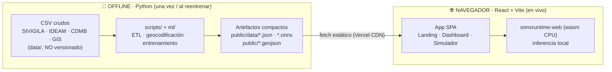
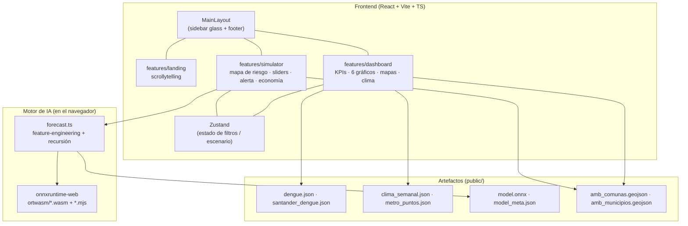
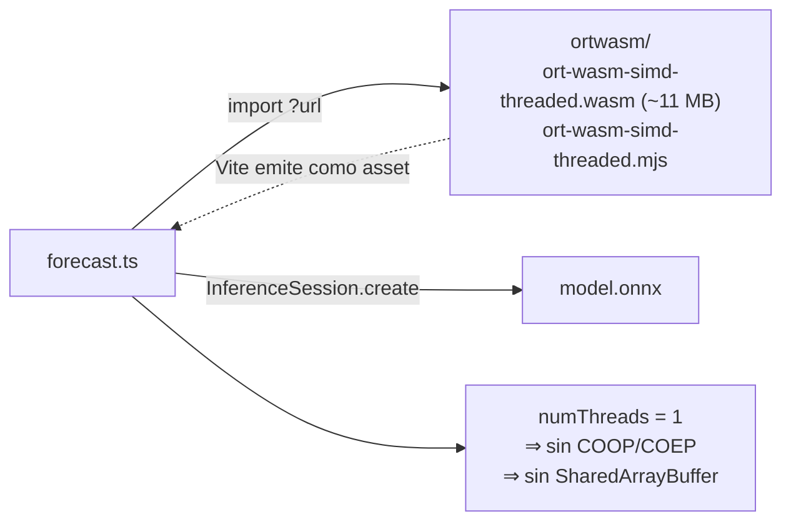
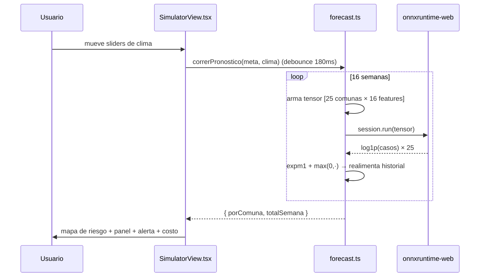
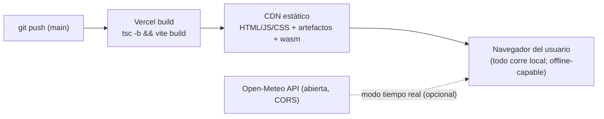

# 🏗️ Arquitectura de la solución

> Visión consolidada de cómo está construido **EcoSalud IA**: las decisiones de fondo, los componentes y cómo fluye el dato desde el CSV crudo hasta el mapa de riesgo en el navegador.
> Profundizan: [`INFORME_SIMULADOR.md`](INFORME_SIMULADOR.md) (código del simulador) · [`04_DIAGRAMAS_FLUJO.md`](04_DIAGRAMAS_FLUJO.md) (flujos paso a paso).

---

## 1. Principio rector: *backendless*

Toda la solución corre como **sitio estático**. No hay servidor de aplicación, ni base de datos, ni API propia. Esto se sostiene en tres decisiones:

| Decisión | Por qué |
|---|---|
| **Procesar datos offline en Python** | el CSV nacional pesa 218 MB; se reduce a artefactos JSON/ONNX de pocos cientos de KB que sí pueden viajar al navegador. |
| **Ejecutar el modelo de IA en el navegador (ONNX)** | robustez en demo en vivo (funciona **offline**, sin WiFi ni servidor), costo de hosting ≈ $0, modelo auditable como archivo. |
| **Desplegar estático en Vercel** | cero infraestructura que mantener; el `git push` despliega. |

---

## 2. Componentes

- **Visualización unificada en ECharts.** Gráficos del dashboard **y** mapas (coropletos, burbujas, mapa de riesgo del simulador) usan ECharts. Evita arrastrar Mapbox/deck.gl (quedaron como dependencias sin uso).
- **Estado con Zustand.** El filtrado del dashboard y el escenario del simulador son 100 % cliente.
- **El motor de IA está aislado** en `features/simulator/forecast.ts`: cualquier vista puede pedir un pronóstico sin conocer ONNX.

---

## 3. Capa de datos: del CSV crudo al artefacto

| Script (`scripts/` · `ml/`) | Entrada | Salida (artefacto) |
|---|---|---|
| `build_dashboard_data.py` | SIVIGILA individual Bga | `dengue.json` (~820 KB) |
| `build_geo_data.py` | SIVIGILA nacional (2,46 M filas) | `santander_dengue.json` |
| `build_climate_data.py` | IDEAM + CDMB | `clima_semanal.json` |
| `geocode_metro.py` | direcciones | `metro_puntos.json` + `comunas_casos.json` |
| `build_municipios_outline.py` | `amb_comunas.geojson` | `amb_municipios.geojson` |
| `build_training_table.py` | varios artefactos | `ml/data/training_table.csv` |
| `train_model.py` | `training_table.csv` | `model.onnx` + `model_meta.json` |

> **Frontera de datos:** todo lo pesado y crudo vive en `data/` y **no se versiona** (`.gitignore`). Solo los artefactos procesados llegan a `public/`. Esto mantiene el repo liviano y garantiza que el navegador nunca descargue datos masivos.

`model_meta.json` es la **pieza de contrato** entre Python y el navegador: contiene `feature_order` (orden exacto de las 16 columnas), las 25 comunas con población e incidencia base, `seed` (últimos 4 casos por comuna), `clima_ranges` (para los sliders) y `metrics`.

---

## 4. El detalle WebAssembly (clave para mantenerlo)

- Backend **wasm en CPU**, `numThreads = 1`: single-thread evita los headers `COOP/COEP` que un hosting estático normal no envía.
- El `.wasm` y su *glue* `.mjs` viven en `src/features/simulator/ortwasm/` y se cargan con `?url`. **Se versionan en git a propósito** para que el build offline funcione.
- No pueden importarse desde `node_modules/.../dist` (lo bloquea el campo `exports`) ni desde `/public` (el dev server de Vite rechaza el `import()` dinámico de un `.mjs` ahí). Por eso viven en `src/`.

---

## 5. Flujo de inferencia (resumen)

El modelo predice **una** semana; el simulador encadena 16 de forma **recursiva**: cada predicción se realimenta como `casos_l1` de la siguiente. Una inferencia ONNX por semana procesa las **25 comunas** en un solo tensor `[25, 16]`.

Detalle completo en [`INFORME_SIMULADOR.md`](INFORME_SIMULADOR.md) §5 e [`INFORME_MATEMATICO.md`](INFORME_MATEMATICO.md) §5.

---

## 6. Despliegue

- **Build:** `tsc -b && vite build` (verificado verde).
- **Única dependencia de red en runtime:** opcional — el modo "tiempo real" consume Open-Meteo (API abierta, sin key, con CORS). Si falla, cae a sliders manuales. Todo lo demás funciona **sin red**.

---

## 7. Atributos de calidad que esta arquitectura entrega

| Atributo | Cómo se logra |
|---|---|
| **Robustez en demo** | inferencia local + wasm versionado → funciona offline |
| **Costo** | hosting estático, inferencia en cliente → ≈ $0 |
| **Privacidad/auditabilidad** | el modelo es un archivo ONNX inspeccionable |
| **Reproducibilidad** | artefactos deterministas (`random_state=42`) desde scripts |
| **Mantenibilidad** | motor de IA aislado; contrato explícito en `model_meta.json` |
| **Rendimiento** | 16 inferencias de batch 25 = milisegundos; recálculo casi instantáneo |

---

## 8. Limitaciones arquitectónicas (declaradas)

- **Sin persistencia ni cuentas:** no hay backend, así que no se guardan escenarios del usuario (por diseño).
- **Tamaño del wasm (~11 MB):** se versiona para robustez offline, a costa de peso del repo.
- **Bundle de ECharts (~1,5 MB):** pendiente de optimizar.
- **Reentrenamiento manual:** no hay pipeline automático de datos → modelo (se corre a mano, es esporádico).
