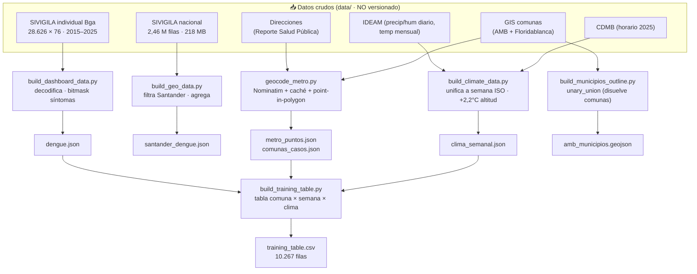
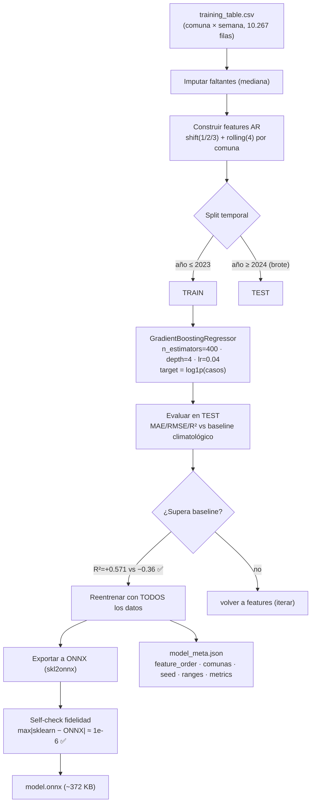
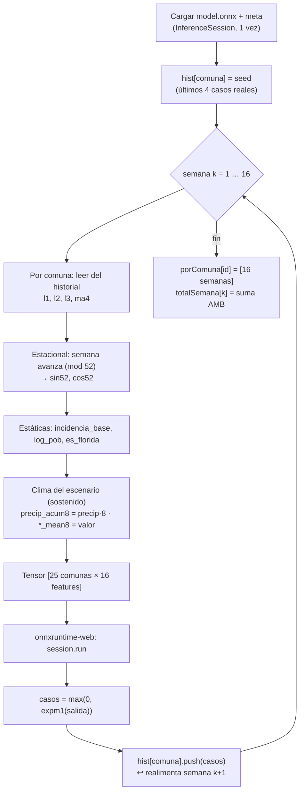
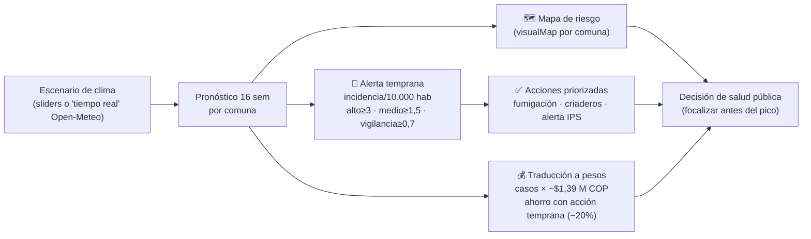
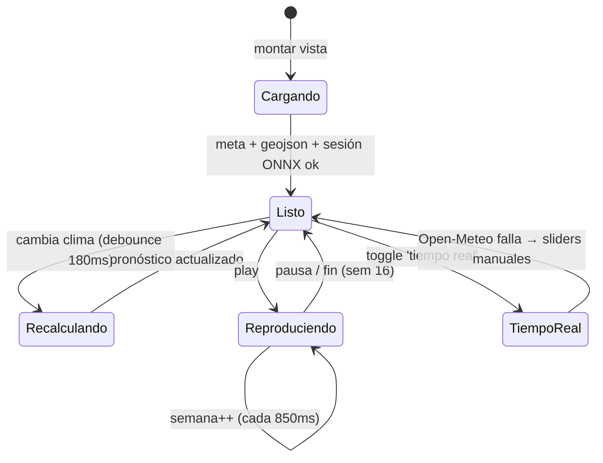

# 🔀 Diagramas de flujo

> Los procesos del proyecto como diagramas (Mermaid). Cinco flujos: **datos**, **entrenamiento**, **inferencia en el navegador**, **ciclo predicción→acción** y **estados de la app**.
> Contexto: [`02_ARQUITECTURA.md`](02_ARQUITECTURA.md) · [`INFORME_MATEMATICO.md`](INFORME_MATEMATICO.md).

---

## 1. Pipeline de datos (ETL offline)

De los cinco datasets crudos a los artefactos que consume el navegador.

---

## 2. Entrenamiento del modelo (`ml/train_model.py`)

> El **split temporal** (entrenar con el pasado, probar con el brote futuro) es deliberadamente exigente: evita "ver el futuro" y demuestra que el modelo **generaliza al brote**.

---

## 3. Inferencia recursiva en el navegador (`forecast.ts`)

El modelo predice **una** semana; se encadena para proyectar **16**.

> Costo: **16 inferencias** de un batch de 25 filas = milisegundos. Por eso mover un slider recalcula el mapa casi al instante.

---

## 4. Ciclo predicción → acción (lo que ve el usuario)

> Cierra el ciclo: el pronóstico no termina en un número, sino en **dónde fumigar** y **cuánto se ahorra**.

---

## 5. Estados de la interfaz del simulador

---

## Cómo se renderizan estos diagramas

Son bloques **Mermaid**: GitHub los renderiza nativamente en el `.md`. Para el informe impreso se pueden exportar a PNG/SVG con [mermaid.live](https://mermaid.live) o la CLI `@mermaid-js/mermaid-cli` (`mmdc -i 04_DIAGRAMAS_FLUJO.md -o diagramas.pdf`).
